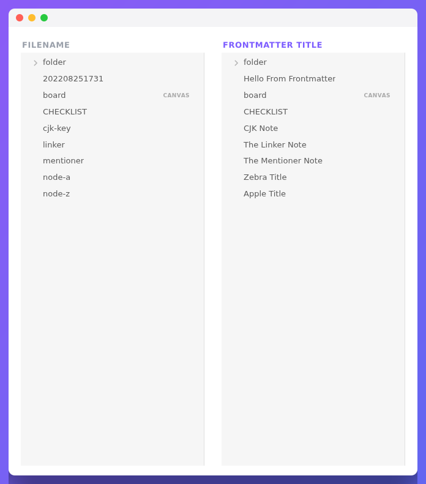

# Front Matter Title

A plugin for [Obsidian](https://obsidian.md) that shows a **friendly title from your note's frontmatter everywhere in the app — without renaming the file.**

If your notes are named like timestamps (`202208251731.md`), random IDs, or any scheme that isn't human‑readable, this plugin lets you keep those filenames while Obsidian displays the title you actually wrote in the note's frontmatter.



> [!IMPORTANT]
> The plugin **never renames or edits your files.** It only changes what Obsidian *displays*. Your filenames on disk stay exactly as they are.

## What you get

You choose where the title is shown — turn each one on or off in settings:

- **File explorer**, **Search**, **Quick switcher / suggestions**, **Bookmarks** and **Backlinks** — see titles instead of filenames while you navigate.
- **Tabs**, **note header**, **inline title** and the **window frame** — see the title while you read and write.
- **Graph** and **Canvas** — nodes and cards show titles too.
- **Links** — optionally rewrite `[[202208251731]]` link text to the note's title.

See the full list with screenshots in **[Features](./docs/Features.md)**.

---

- [Installation](#installation)
- [Quick start](#quick-start)
- [Features](./docs/Features.md)
- [Templates](./docs/Templates.md) · [Template examples](./docs/TemplateExamples.md)
- [Settings reference](./docs/Settings.md)
- [Processor (advanced)](./docs/Processor.md)
- [FAQ & troubleshooting](./docs/FAQ.md)
- [API](#api)

---

## Installation

### From the Obsidian app (recommended)

Open **Settings → Community plugins → Browse**, search for **Front Matter Title**, install it and enable it.

### Using BRAT

Install via the [BRAT](https://github.com/TfTHacker/obsidian42-brat) plugin and point it at this repository.

### Manual

Download the latest `obsidian-front-matter-title-*.zip` from the [latest release](https://github.com/Snezhig/obsidian-front-matter-title/releases/latest) and unpack it into your vault under `.obsidian/plugins/`.

## Quick start

Three steps, about a minute:

**1. Add a title to a note's frontmatter.** Open any note and put a `title` at the top:

```yaml
---
title: My readable note title
---
```

**2. Tell the plugin which key to read.** Open **Settings → Front Matter Title**. The **Common main template** is `title` by default — that means the plugin reads the `title` key from each note. Leave it as is to use the example above.

**3. Turn on where you want it shown.** In the same settings page, enable the **Explorer** feature. The note in your file explorer now shows *My readable note title* instead of the filename.

That's it. Enable more places from **[Features](./docs/Features.md)**, and learn how to build smarter titles in **[Templates](./docs/Templates.md)**.

> A frontmatter value used as a title **must be** a string, a number, or a list. If a key is missing or empty, the plugin falls back to the original filename. See [Template examples](./docs/TemplateExamples.md) for every case.

## API

Looking to integrate with another plugin? See the [API provider](https://github.com/Snezhig/front-matter-plguin-api-provider).

## Thank you

If you like this plugin and would like to buy me a coffee, you can!

<a href="https://www.buymeacoffee.com/snezhig" target="_blank">

</a>

## Note

Feel free to open an issue for bugs, mistakes, or ideas for this plugin.
