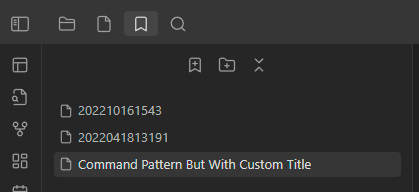
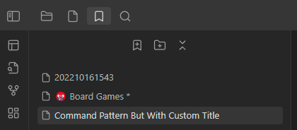
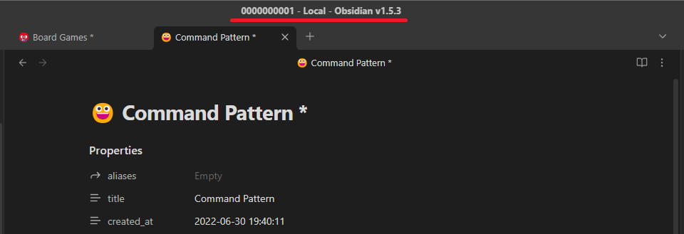
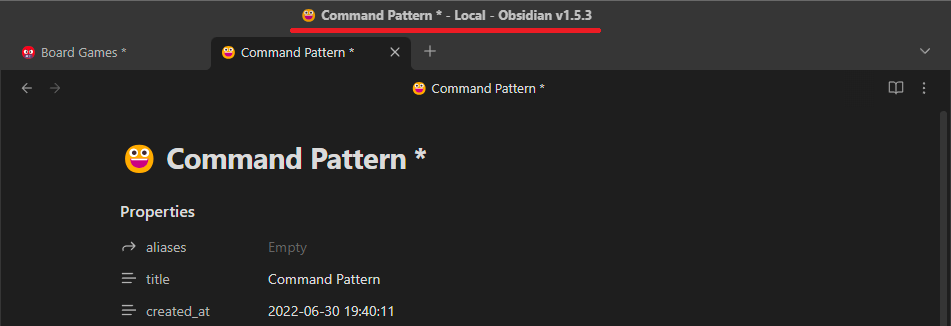

# Features

## Alias

> Modify frontmatter cache to add or replace alias or just ensure that the one exists

|         Disabled         |         Enabled         |
|:------------------------:|:-----------------------:|
|  |  |

## Explorer

> Display titles in app`s file explorer

|          Disabled           |          Enabled           |
|:---------------------------:|:--------------------------:|
|  |  |

## Explorer Sort

> Sort files by custom titles. Available only if Explorer is enabled

|          Disabled          |            Enabled             |
|:--------------------------:|:------------------------------:|
|  |  |

## Graph

> Display titles in app's graph and local-graph

|         Disabled         |         Enabled         |
|:------------------------:|:-----------------------:|
|  |  |

## Header

> Display title in opened file's header

|          Disabled          |          Enabled          |
|:--------------------------:|:-------------------------:|
|  |  |

## Bookmarks

> Display title in bookmarks window

|         Disabled          |         Enabled          |
|:-------------------------:|:------------------------:|
|  |  |

## Search

> Display titles in the search window

|         Disabled          |         Enabled          |
|:-------------------------:|:------------------------:|
|  |  |

## Suggest

> Display titles in suggest modal\windows.

|            Disabled            |            Enabled            |
|:------------------------------:|:-----------------------------:|
|  |  |
|  |  |

## Tab

> Display titles in leaf's tab

|        Disabled        |        Enabled        |
|:----------------------:|:---------------------:|
|  |  |

## Note Link

> [Click Here](./Features/NoteLink.md)

## Window Frame

|          Disabled           |          Enabled           |
|:---------------------------:|:--------------------------:|
|  |  |