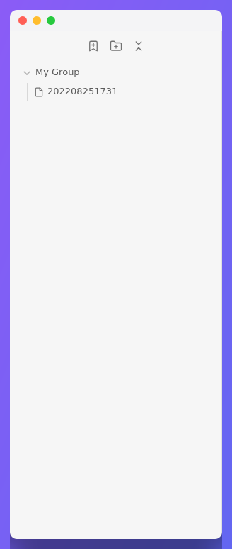
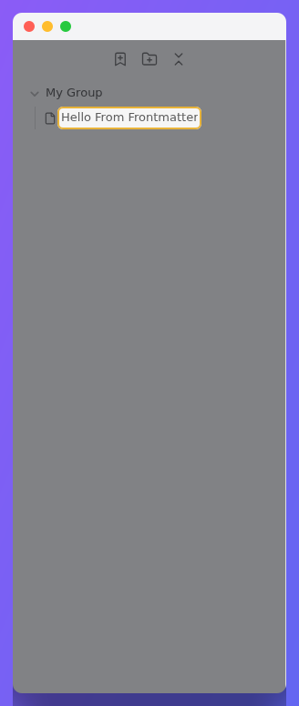
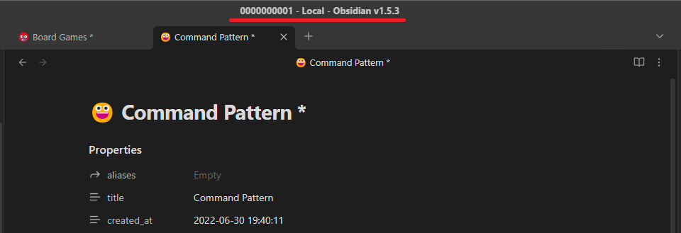
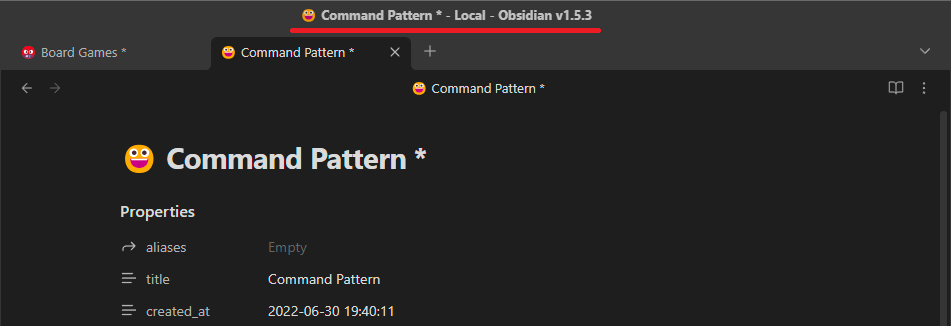

# Features

A **feature** is a single place in Obsidian where the plugin replaces the displayed filename with your frontmatter title. Each one is independent: turn on only the places you care about in **Settings → Front Matter Title → Features**.

Every feature uses your title [template](./Templates.md). By default they all share the **Common main template** (`title`), but each feature can use its own template — click **Manage** next to a feature to set one.

The features below are grouped by where you'll notice them.

---

## Navigation & lists

These help you find notes by their real title instead of a cryptic filename.

### Explorer

> Replace shown titles in the file explorer.

The most common feature to enable first.

|          Disabled           |          Enabled           |
|:---------------------------:|:--------------------------:|
|  |  |

#### Explorer → Sort

When **Explorer** is on, you can also toggle **Sort** (click **Manage** on the Explorer feature). The explorer then sorts files by their displayed title instead of by filename — so the order matches what you actually read.

|            Sort off             |            Sort on             |
|:-------------------------------:|:------------------------------:|
|  |  |

### Search

> Replace shown titles in the search results panel.

|         Disabled          |         Enabled          |
|:-------------------------:|:------------------------:|
|  |  |

### Suggest

> Replace shown titles in suggest modals — the quick switcher, link autocompletion, and similar pop‑ups.

|            Disabled            |            Enabled            |
|:------------------------------:|:-----------------------------:|
|  |  |
|  |  |

### Bookmarks

> Replace shown titles in the built‑in Bookmarks plugin.

|         Disabled          |         Enabled          |
|:-------------------------:|:------------------------:|
|  |  |

### Backlink

> Replace shown titles in the Backlinks panel (Linked mentions).

|          Disabled           |          Enabled           |
|:---------------------------:|:--------------------------:|
|  |  |

---

## Editor & tabs

These show the title while you read and write the note.

### Tabs

> Replace shown titles in tabs.

|        Disabled        |        Enabled        |
|:----------------------:|:---------------------:|
|  |  |

### Header

> Replace titles in the header of open panes (leaves) and keep them updated.

|          Disabled          |          Enabled          |
|:--------------------------:|:-------------------------:|
|  |  |

### Inline

> Replace the shown title in the **Inline Title** (the large title rendered at the top of the note body).

|         Disabled          |         Enabled          |
|:-------------------------:|:------------------------:|
|  |  |

### Window Frame Title

> Replace the shown title in the window frame (the OS / app title bar).

|          Disabled           |          Enabled           |
|:---------------------------:|:--------------------------:|
|  |  |

---

## Visual

### Graph

> Replace shown titles in the graph and local‑graph.

|         Disabled         |         Enabled         |
|:------------------------:|:-----------------------:|
|  |  |

### Canvas

> Replace shown titles in Canvas cards.

|         Disabled          |         Enabled          |
|:-------------------------:|:------------------------:|
|  |  |

---

## Content‑changing features

> [!WARNING]
> Unlike the features above, these two affect the metadata cache or the text of your notes. Read the notes before enabling.

### Alias

> Modify the alias in the metadata cache. Your real alias in the file is **not** affected — only Obsidian's cache, so the title becomes searchable/linkable as an alias.

This feature has two options (click **Manage**):

**Validator** — which files it processes:

| Option | What it does |
|---|---|
| **Frontmatter Auto** | If a note has no frontmatter, an entry is created **in the cache**. Convenient, but side‑effects may occur. |
| **Frontmatter Required** | Only notes that already have frontmatter are processed. Safer. |

**Strategy** — what it does with the alias:

| Option | What it does |
|---|---|
| **Ensure** | Set the title as an alias only if no alias exists yet. |
| **Adjust** | Add the title to the aliases without touching existing ones. |
| **Replace** | Replace the current alias with the title. |

|         Disabled         |         Enabled         |
|:------------------------:|:-----------------------:|
|  |  |

### Note Link

> Replace the link text of internal `[[links]]` inside your notes so they read as the target's title. **This edits your note files.**

Full guide, options and examples: **[Note Link](./Features/NoteLink.md)**.

In short, it has two options:

- **Strategy** — *Replace all links* or *Replace only links without alias* (don't override links you've already aliased).
- **Approval** — *Show approve modal* (confirm each batch of changes) or *Use auto approve* (apply automatically).
