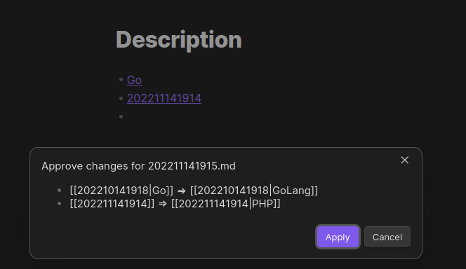
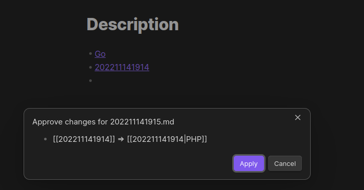

# Note Link Feature

This feature work with
internal [links to files](https://help.obsidian.md/Linking+notes+and+files/Internal+links#Link+to+a+file)

When feature is enabled, and you are editing a file plugins will check internal links to update their aliases.

**Options**

- **Approve**:
    - **Use auto approve** - Any changes will be applied automatically
    - **Show approve modal** - Any changes will trigger modal with supposed changes, which can be declined
- **Replace**:
    - **Replace all links** - Feature will compare any link and change them
    - **Replace only without alias** - Feature will only compare links without aliases

## Example

Try to change out file with option when `Replace` is `Replace all links`

The following modal asks to approve some changes:

- Replace `[[202210141918|Go]]` with `[[202210141918|GoLang]]`
- Replace `[[202211141914]]` with `[[202211141914|PHP]]`

But if `Replace` is `Replace only without alias` the modal will be different:

Because `[[202210141918|Go]]` already has `Go` alias, feature does not try to change it

