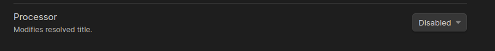
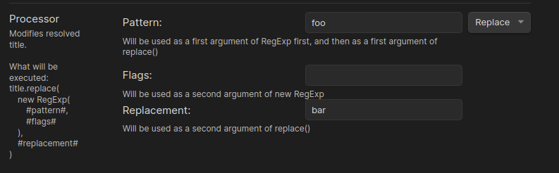
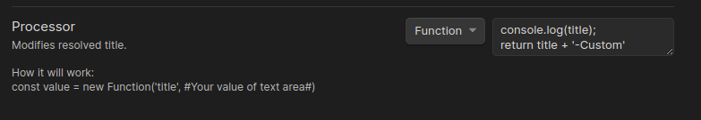

# Processor

Processor allows you to modify new title in a way you want to.
By default, processor is disabled.



## Replace

In this mode processor will use RegExp to modify title.



Plugin uses the following template:

```typescript
title.replace(new RegExp("#pattern#", "#flags#"), "#relacement#");
```

Where:

- `title` - resolved title by settings. Not original filename.
- `replace` - [Doc](https://developer.mozilla.org/en-US/docs/Web/JavaScript/Reference/Global_Objects/String/replace)
- `new Regexp` - [Doc](https://developer.mozilla.org/en-US/docs/Web/JavaScript/Reference/Global_Objects/RegExp)
- `#pattern#` - value from `Pattern` setting inside Processor
- `#flags#` - value from `Flags` setting inside Processor
- `#replacement#` - value from `Replacement` setting inside Processor

For example, you have set up plugin to pull new title from `new_title` path and this key has `foo` value.
After plugin resolves `foo` title it will execute the following construction:

```typescript
//It will return "bar" as new value
'foo'.replace(new RegExp('foo'), 'bar');
```

In this case `bar` value will be used as shown title

## Function

In this mode processor will use custom function you write inside text area:


You can read more about this
logic [here](https://developer.mozilla.org/en-US/docs/Web/JavaScript/Reference/Global_Objects/Function)
Inside your function you will be able to use `title` variable which contains resolved title.
A value returned by your function will be used as shown title
