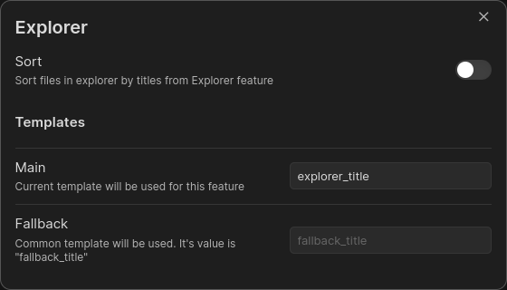

# Templates

The main thing in plugin is `template` which tells plugin how to build new title for any file.

Commonly template is a key from yaml block of file's head.

By default, template is `title` and fallback template is `fallback_title`;

Fallback template is used when common template is not resolved.

Both of templates may be simple and complex:

- Simple means that template contains just a key `title` or path `title.value`; [Examples](TemplateExamples.md)
- Complex means that template contains one or more keys\paths and\or static
  symbols `{{title}} static text {{title.valie}}`; [Examples](TemplateExamples.md)

## Feature's Templates

Also, plugin has `Feature's templates` and you can set templates for each feature individually

Each feature, when it's enabled, has "Manage" button. Click on it and you will see the following modal window:

Let's look at the **Templates** section in the example:

- `Main` - Explorer feature has its main template and it will be used for this feature
- `Fallback` - Explorer feature does not has its fallback template and default template (fallback_title) will be used

