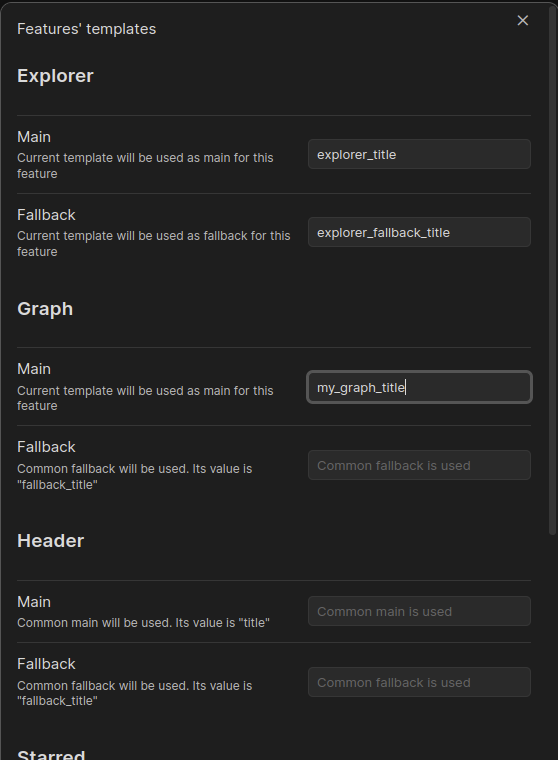

# Templates

The main thing in plugin is `template` which tells plugin how to build new title for any file.

Commonly template is a key from yaml block of file's head.

By default, template is `title` and fallback template is `fallback_title`;

Fallback template is used when common template is not resolved.

Both of templates may be simple and complex:

- Simple means that template contains just a key `title` or path `title.value`; [Examples](TemplateExamples.md)
- Complex means that template contains one or more keys\paths and\or static
  symbols `{{title}} static text {{title.value}}`; [Examples](TemplateExamples.md)

## Features' Templates

Also, plugin has `Features' templates` and you can set templates for each feature individually

In screenshot below we can see some defined templates:

- `Explorer` has its own templates and this feature will be use them
- `Graph` has only common template. If its template is not resolved, it will use global fallback template
- `Header` does not has any specific templates, so it will use global templates

