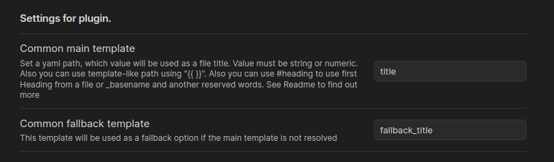
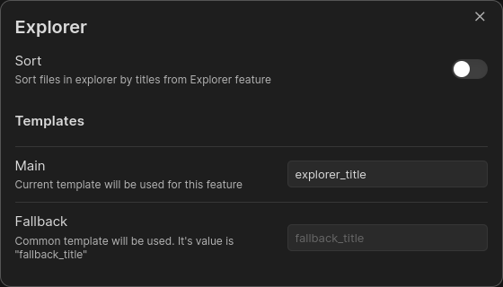

# Templates

A **template** tells the plugin how to build the displayed title for a note. You set it in **Settings → Front Matter Title**.

There are two templates shared by every feature:

- **Common main template** — tried first. Default: `title`.
- **Common fallback template** — used only when the main template can't be resolved (the key is missing or empty). Default: `fallback_title`.

If both fail, the plugin shows the original filename. A value used as a title must be a **string, number, or list** — objects are not supported.



Templates go from dead simple to powerful. Most people never need more than Level 1.

---

## Level 1 — A single key

Type the name of a frontmatter key. The plugin uses that key's value.

```yaml
---
title: My readable title
---
```

With the default template `title`, the note above is displayed as **My readable title**.

**Nested keys** use dot‑notation. Template `book.title` reads:

```yaml
---
book:
  title: The Great Gatsby   # displayed as "The Great Gatsby"
---
```

> **Tip:** if a template is just one key, write `title`, **not** `{{title}}`. The single‑key form is faster.

## Level 2 — Other sources & fallback logic

Beyond frontmatter keys, a template can pull from:

- **`#heading`** — the first heading in the note.
- **`_basename`** — a field from Obsidian's file info (the `_` prefix). `_basename` is the filename without extension; other [TFile](https://github.com/obsidianmd/obsidian-api/blob/master/obsidian.d.ts) fields work too.

**"Or" logic with `|`** — try several keys, use the first non‑empty one:

```
title|heading_title|name
```

This uses `title` if present, otherwise `heading_title`, otherwise `name`.

## Level 3 — Composite templates

Use `{{ }}` to combine several values with static text:

```
{{author}} — {{title}}
```

For a note with `author: Snezhig` and `title: Project ideas`, this displays **Snezhig — Project ideas**. Everything outside the `{{ }}` (spaces, dashes, words) is kept as‑is. You can also use `|` logic inside the brackets: `{{ title|heading }}`.

> **Performance:** only wrap values in `{{ }}` when you combine more than one. For a single value, plain `title` is faster than `{{title}}`.

See **[Template examples](./TemplateExamples.md)** for a full table covering arrays, missing keys, objects, and edge cases.

---

## Per‑feature templates

By default every feature uses the common templates above. But you can override them per feature — handy when, say, the explorer should show a short title but the window frame a longer one.

When a feature is enabled it shows a **Manage** button. Click it to open the feature's modal:



In the **Templates** section:

- **Main** — this feature's own main template. If set, it's used instead of the common one.
- **Fallback** — this feature's own fallback. If empty, the common fallback (`fallback_title`) is used.

---

## Common recipes

| Goal | Template |
|---|---|
| Just use the `title` key | `title` |
| `Author — Title` | `{{author}} — {{title}}` |
| Title, or the note's first heading if there's no title | `title\|#heading` |
| Title, or status if there's no title | `title\|status` |
| Use the first heading as the title | `#heading` |
